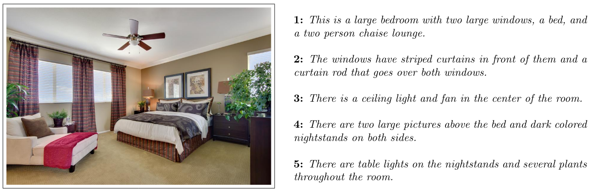

# "tell me more": a corpus of image description sequences
We present a dataset of _description sequences_, a sequence of expressions that together are meant to single out one image from an (imagined) set of other similar images. These sequences were produced in a monological setting, but with the instruction to imagine they were provided to a partner who successively asked for more information (hence, *tell me more*). The example of such sequence is given below:



## Structure of the repository
```bash
├── README.md
├── data
│   ├── sequences.csv
│   └── splits.json
├── papers
│   └── inlg19_short.pdf
└── scripts
    └── download_images.sh
```
```sequences.csv``` contains the dataset of description sequences. It has the following columns:
- ```seq_id```: unique id of the sequence
- ```image_id```: id of the image ()
- ```image_path```: path to the image, starting from the directory with all ADE20k images
- ```image_cat```: type of the image
- ```image_subcat```: image subtype, if present (`outdoor`, for example)
- ```d1-d5```: five descriptions in a sequence, corresponding to the image

```splits.json``` is required if you want to use our original splits and, for example, exclude images labeled as `extra`, for which we have additionally collected description sequences, but did not include them in our analysis, described in the paper. However, these extra sequences are available in ```sequences.csv```.

```download_images.sh``` is the bash script, which will download ADE20k corpus into your repository.

## Citation
If you find our data useful, please cite
  > Nikolai Ilinykh, Sina Zarrieß, David Schlangen (2019): Tell Me More: A Dataset of Visual Scene Description Sequences. In Proceedings of the 12th International Conference on Natural Language Generation, Tokyo, October-November 2019

This paper can be found [here](papers/inlg19_short.pdf).
